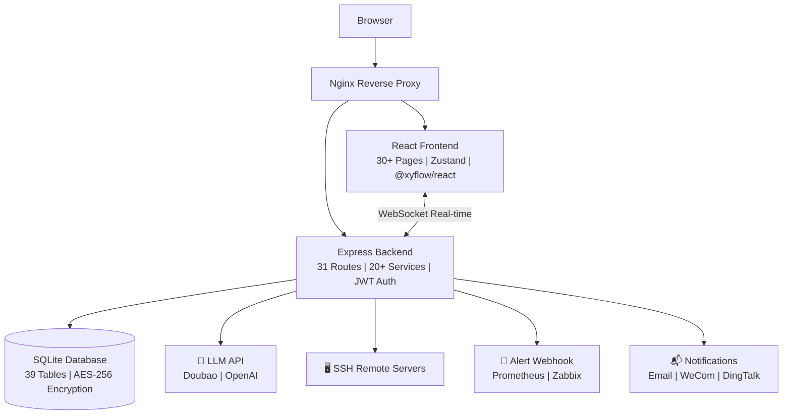

[English](README.en.md) | [中文](README.md)

---

**Important License⚠️ Change Notice (2026-05-27)**

Effective today, all new code submissions in this project will be open-sourced under the **Mozilla Public License 2.0 (MPL-2.0)** license.
- All code submitted before 16:00, May 27, 2026, remains under the original MIT license
- Any derivative works based on versions of this project after 2026-05-27 must comply with the MPL-2.0 license
- This project does not allow commercial use such as **closed-source secondary development, packaged sales, SaaS operations**, and commits to being permanently open-source!

👤 Author: Tan Ce | IT Online


# ITOps Agent Platform

Enterprise-grade IT Operations Multi-Agent Automation Platform — A fully open-source intelligent IT operations solution powered by Large Language Models.

📝[Project Vision & Community Co-creation](项目愿景与社区共建.md) 📝[Project Learning Guide](从入门到精通（项目教学书籍）)

[](https://github.com/qinshihu/itops-agent-platform/actions/workflows/ci.yml)
[](https://github.com/qinshihu/itops-agent-platform/actions/workflows/release.yml)
[](https://github.com/qinshihu/itops-agent-platform/releases/latest)
[](LICENSE)

🌐 **Official Website**: <https://www.zjzwfw.cloud/ITOpsAgentinfo>


## Overview

ITOps Agent Platform is an enterprise-grade full-stack IT operations automation platform. Through visual workflow orchestration, multiple AI Agents collaborate to automate server inspection, alert handling, fault diagnosis, compliance checks, and other IT operations tasks.



> 📐 [View Full Architecture Diagram →](./docs/ARCHITECTURE_DIAGRAM.md)

### Core Features

- **Multi-Agent Collaboration** — 9 preset IT operations Agents with custom creation support, covering alerts, diagnostics, inspection, compliance, and more
- **Visual Workflow** — Drag-and-drop orchestration with serial/parallel/conditional branching and real-time WebSocket progress pushing
- **Web SSH Terminal** — Interactive remote terminal based on xterm.js with real-time I/O, window auto-resize, and bidirectional communication
- **Host Management Enhancement** — Multi-level group tree structure, CSV/JSON bulk import, automatic SSH information collection (CPU/Memory/Disk/OS)
- **Data Import/Export** — Bulk server import via CSV/JSON, export alerts, audit logs, and report data
- **Backup & Recovery** — Complete database backup and recovery with compression, integrity verification, and graceful restart
- **Auto Remediation** — Automatic trigger of remediation strategies from alerts with custom workflows and approval processes
- **Root Cause Analysis** — AI-driven alert root cause analysis for quick problem identification
- **Alert Noise Reduction** — Intelligent alert deduplication and suppression to reduce alert storms
- **Server Management** — SSH remote connections, command execution, historical audits, and 14 compliance checks
- **Alert Center** — Webhook reception for Prometheus/Zabbix/Generic alerts with automatic noise reduction and workflow triggering
- **Knowledge Base + RAG** — 22 preset knowledge entries with intelligent retrieval injected into LLM context
- **AI Copilot** — Natural language conversational IT operations assistant with automatic system state awareness
- **Multi-Model Support** — Supports Doubao, OpenAI, and locally deployed models (Ollama/LM Studio/vLLM) for complete data privacy
- **Enterprise Security** — AES-256-GCM encryption, JWT authentication, rate limiting, audit logs, and memory leak protection
- **Docker One-Click Deployment** — Containerized frontend/backend, 5-minute deployment, Alibaba Cloud image registry support
- **CI/CD Automation** — Complete GitHub Actions pipeline for automatic build, test, release, and image push

## Security Features

Multi-layered security design to protect your servers and data:

| Security Measure | Description |
|---------|------|
| **🔐 AES-256-GCM Encryption** | Bank-level encryption for server passwords and SSH keys |
| **🎫 JWT Dual-Token Auth** | Access Token + Refresh Token with auto-refresh and blacklist logout |
| **🔒 Login Failure Lock** | Account locked for 30 minutes after 5 failed attempts |
| **💪 Password Complexity** | Enforces 8+ chars with uppercase, lowercase, numbers, and special chars |
| **📜 Complete Audit Trail** | All logins, commands, and configuration changes are logged |
| **🚫 Sensitive Info Masking** | Passwords and API keys automatically masked in logs |
| **🛡️ Non-Root Execution** | Docker containers run as non-root with least privilege |
| **🧱 Nginx Security Headers** | HSTS, CSP, X-Frame-Options, XSS Protection |
| **⚡ API Rate Limiting** | Prevents malicious requests and brute force attacks |
| **🌐 Webhook IP Whitelist** | Configurable IP whitelist for alert webhooks |
| **✍️ Webhook Signature** | HMAC-SHA256 signature verification for trusted alerts |
| **🏠 Local AI Support** | Ollama, LM Studio, vLLM support for 100% on-premise data |
| **🔑 Forced Password Change** | Mandatory password change on first login |

> **Data Security Goal**: All server credentials are only stored locally encrypted and never sent to third-party AI. Agent execution commands and outputs stay within your server environment.

## Supported AI Models

| Type | Provider/Framework | Support Status | Recommended Scenario |
|------|------------|---------|---------|
| **Domestic Cloud API** | VolcEngine · Doubao | ✅ Fully Supported | Recommended for users in China |
| **International Cloud API** | OpenAI (GPT-4o, etc.) | ✅ Fully Supported | Users with external network access |
| **Local Deployment** | Ollama / LM Studio / vLLM | ✅ Fully Supported | High data security requirements |

**Recommended Local Models**: Qwen2.5, Llama3, DeepSeek-Coder, Yi, ChatGLM, Phi-3, etc. (OpenAI-compatible).

## Tech Stack

| Layer      | Technology                                  |
| ------ | ------------------------------------------- |
| Frontend | React 18 + TypeScript + Tailwind CSS + Vite |
| State Management | Zustand + React Query               |
| Workflow Editor | @xyflow/react                        |
| Backend  | Node.js + Express + TypeScript              |
| Database | SQLite (better-sqlite3)                     |
| Real-time Communication | Socket.io                      |
| Remote Connection | SSH2                                 |
| Deployment | Docker + Docker Compose + Nginx           |

## Quick Start

### Option 1: One-Click Script Deployment (Recommended)

```bash
# Windows
.\deploy.ps1

# Linux/Mac
chmod +x deploy.sh && ./deploy.sh
```

The script will automatically pull the Alibaba Cloud image, generate configuration, start services, and verify health status.

### Option 2: Docker Compose Deployment

```bash
# 1. Configure environment variables
cp .env.example .env

# 2. Build and start (local source build)
docker-compose up -d --build

# 3. Access
# Frontend: http://localhost:8080
# Backend: http://localhost:3001
# Health: http://localhost:3001/health
```

### Option 3: Pull Alibaba Cloud Image Deployment

```bash
# Pull images
docker pull registry.cn-hangzhou.aliyuncs.com/huluwa666/tsq-images-hub:IT_Onlin-ITOps-backend-latest
docker pull registry.cn-hangzhou.aliyuncs.com/huluwa666/tsq-images-hub:IT_Onlin-ITOps-frontend-latest

# Start services
docker-compose up -d
```

Or use the simplified version:

```bash
docker-compose -f docker-compose.simple.yml up -d --build
```

Or one-click script:

```bash
# Windows
.\start.ps1

# Linux/Mac
chmod +x start.sh stop.sh && ./start.sh
```

### Local Development

#### Option 1: Docker Local Development (Recommended, Hot Reload)

```bash
# Windows
cd local-dev
.\start-dev.bat

# Linux/Mac
cd local-dev
./start-dev.sh
```

**Features:**
- Frontend: Vite hot reload, instant refresh on code change http://localhost:5173
- Backend: tsx watch hot reload, automatic restart on code change http://localhost:3001
- Database: Docker volume persistence, data preserved on container stop
- Debug: Node.js debug port (localhost:9229)

#### Option 2: Traditional Local Development

```bash
# Start frontend and backend development servers
npm run dev
```

- Frontend: Vite hot reload http://localhost:3000
- Backend: tsx watch hot reload http://localhost:3001
- Database: SQLite file persisted at `backend/data/app.db`

**Default Admin**: `admin` / `admin`

> ⚠️ First login will force password change

## Feature Modules

### Dashboard

System overview displaying servers, alerts, tasks, and other core metrics.

### Web SSH Terminal

- Interactive SSH terminal based on xterm.js
- Real-time bidirectional communication (WebSocket)
- Window size auto-adaptation
- Connection status visualization
- Terminal session management (30 min TTL auto-cleanup)

### Host Management

- Multi-level group tree structure with filtering
- CSV/JSON bulk import with automatic SSH validation and deduplication
- One-click host information collection (OS/CPU/Memory/Disk/IP)
- Server cards with group tags and hardware info
- CSV/JSON export support

### Server Management

- Add/Edit/Delete servers with SSH password or key authentication
- Tag filtering and connection testing
- Online shell command execution with command history audit
- 14 system compliance checks (CPU/Memory/Disk/Network/Service/Security)
- Command and compliance history JSON export

### Agent Management

- 9 preset Agents: Alert Handling, Fault Diagnosis, Log Analysis, System Inspection, Change Execution, Document Generation, Compliance Check, Server Command Execution, Auto Inspection
- Custom Agent creation with system prompts, models, and temperature parameters
- Agent testing and execution history tracking

### Workflow Orchestration

- Visual drag-and-drop editor
- 6 preset workflow templates
- Context passing and server selection support
- Execution order topological sorting with visual position priority

### Task Execution

- Real-time WebSocket progress pushing
- Node highlighting and thinking process display
- Pause/Resume/Cancel support
- Automatic Markdown execution report generation

### Alert Center

- Webhook reception: Prometheus Alertmanager / Zabbix / Generic format
- Automatic alert noise reduction and deduplication
- Alert→Workflow automatic mapping and triggering
- Status management: New/Confirmed/Resolved

### Notification System

- Webhook, email, WeCom, and DingTalk notifications
- Notification configuration management
- Automatic system notification pushing

### Data Import/Export

- CSV bulk server import with standard template
- Intelligent deduplication: hostname+name combined deduplication
- Detailed error reporting for easy troubleshooting
- Transaction guarantee: all or nothing import
- Export: server list, alerts, audit logs, reports
- Export formats: CSV and JSON

### Backup & Recovery

- Automatic/manual database backup with gzip compression
- Backup integrity verification (file size validation)
- Graceful restart after recovery for data consistency
- Backup history management and cleanup policies
- Scheduled automatic backup support

### Knowledge Base

- 22 preset knowledge entries
- Enhanced RAG retrieval with keyword+semantic relevance ranking
- Automatic injection into LLM conversation context
- Bulk import/export

### AI Copilot

- Natural language conversational IT operations assistant
- Automatic awareness of system alerts, servers, and task status
- Rule-based quick response + LLM deep analysis

### Scheduled Tasks

- 4 preset scheduled tasks
- Cron expression configuration
- Automatic execution of specified workflows

### Users & Audit

- User management (admin/operator/viewer roles)
- JWT authentication + Token blacklist
- Complete operation audit trail

### Report System

- Automatic Markdown report generation from workflow execution
- Report template management
- Report viewing and download

## Project Structure

```
├── backend/
│   └── src/
│       ├── app.ts                  # Express application entry
│       ├── models/database.ts      # SQLite database initialization and preset data
│       ├── routes/                 # API routes (31 modules)
│       ├── services/               # Business logic (20+ services)
│       ├── middleware/             # Middleware (6: auth, errorHandler, rateLimiter, validation, trace, commandFilter)
│       ├── websocket/              # WebSocket real-time communication
│       └── utils/                  # Utility functions
├── frontend/
│   └── src/
│       ├── App.tsx                 # React application entry
│       ├── pages/                  # Page components (27)
│       ├── components/             # Common components
│       ├── contexts/               # React Context
│       ├── hooks/                  # Custom Hooks
│       └── lib/                    # Utility library
├── docker/                         # Docker production configuration
├── docs/                           # Technical documentation
├── examples/                       # Test scripts and examples
├── .github/workflows/              # GitHub Actions CI/CD configuration
├── docker-compose.yml              # Production Docker Compose
├── docker-compose.simple.yml       # Simplified Docker Compose
├── deploy.ps1 / deploy.sh          # One-click deployment scripts
├── start.ps1 / start.sh            # One-click start scripts
├── stop.ps1 / stop.sh              # One-click stop scripts
└── .env.example                    # Environment variable example
```

## Documentation Navigation

| Document | Description |
| -------- | ----------- |
| [Deployment Guide](./docs/DEPLOYMENT.md) | Detailed deployment instructions |
| [Technical Specification](./docs/SPEC.md) | Feature specs and interface definitions |
| [API Documentation](./docs/API.md) | Complete API reference |
| [Architecture Design](./docs/ARCHITECTURE.md) | System architecture overview |
| [Development Guide](./docs/DEVELOPMENT.md) | Local development setup |
| [Production Guide](./docs/PRODUCTION.md) | Production best practices |
| [Web Terminal](./docs/WEB_TERMINAL.md) | Web SSH terminal docs |
| [Host Management](./docs/SERVER_MANAGEMENT.md) | Host management features |
| [Network Device Inspection](./docs/NETWORK_DEVICE_INSPECTION.md) | Network inspection features |
| [Changelog](./docs/CHANGELOG.md) | Version update history |
| [Test Guide](./docs/TEST_GUIDE.md) | Testing instructions |
| [QAnything Integration](./docs/QANYTHING_INTEGRATION.md) | Knowledge base integration |
| [Workflow Guide](./docs/WORKFLOW_GUIDE.md) | Workflow orchestration guide |
| [Auto Remediation](./docs/AUTO_REMEDIATION_DESIGN.md) | Alert auto remediation design |

## Environment Variables

| Variable | Description | Default |
| -------- | ----------- | ------- |
| `NODE_ENV` | Runtime environment | production |
| `PORT` | Backend port | 3001 |
| `DATABASE_PATH` | Database path | ./data/app.db |
| `JWT_SECRET` | JWT signing key (must change in production) | Auto-generated in dev |
| `JWT_EXPIRES_IN` | Access Token validity | 24h |
| `ADMIN_INITIAL_PASSWORD` | Admin initial password (optional) | admin (default) |
| `ALLOWED_ORIGINS` | CORS allowed origins (comma-separated) | http://localhost:3000,http://localhost:80,http://localhost:8080 |
| `DOUBAO_API_KEY` | Doubao API key (can also set in UI) | - |
| `DOUBAO_API_BASE` | Doubao API base URL | https://ark.cn-beijing.volces.com/api/v3 |
| `DOUBAO_MODEL` | Doubao model name | doubao-4o |
| `OPENAI_API_KEY` | OpenAI API key (can also set in UI) | - |
| `OPENAI_API_BASE` | OpenAI API base URL | https://api.openai.com/v1 |
| `OPENAI_MODEL` | OpenAI model name | gpt-4o |
| `LOCAL_AI_API_BASE` | Local AI API base URL (Ollama, etc.) | - |
| `LOCAL_AI_MODEL` | Local AI model name | - |
| `WEBHOOK_VERIFY_ENABLED` | Enable Webhook signature verification | false |
| `WEBHOOK_SECRET` | Webhook signing key (required if verification enabled) | - |
| `WEBHOOK_IP_WHITELIST` | Webhook IP whitelist (comma-separated, empty for all) | - |
| `LOG_LEVEL` | Log level | info |

## Security Features Detail

### Authentication & Access Control

- **JWT Dual-Token**: Access Token (24h) + Refresh Token (7d), auto-refresh, blacklist logout
- **Login Failure Lock**: 5 failed attempts lock account for 30 minutes
- **Forced Password Change**: Mandatory on first login
- **Password Complexity**: 8+ chars with uppercase, lowercase, numbers, special chars

### Data Encryption & Security

- **AES-256-GCM Encrypted Storage**: Bank-level encryption with auto-generated keys
- **bcrypt Password Hashing**: Cost factor 12, rainbow table resistant
- **Automatic Sensitive Info Masking**: Passwords and API keys masked in logs
- **Email Template XSS Protection**: HTML auto-escaped

### API & Network Security

- **API Rate Limiting**: Different limits per endpoint
- **Nginx Security Headers**: HSTS/CSP/X-Frame-Options/XSS-Protection/Referrer-Policy/Permissions-Policy
- **CORS Whitelist**: Configurable allowed cross-origin sources
- **Webhook Security**:
  - HMAC-SHA256 signature verification
  - IP whitelist for alert sources
  - Rate limiting to prevent DoS

### Container & Deployment Security

- **Non-Root Execution**: Containers run as non-root with least privilege
- **Graceful Shutdown**: SIGTERM/SIGINT handling, 30s timeout
- **Global Exception Handling**: uncaughtException/unhandledRejection captured
- **Automatic Cleanup**: Token blacklist, terminal sessions, user cache with TTL

### Audit & Traceability

- **Complete Audit Trail**: All logins, commands, configuration changes logged
- **User Lock Audit**: Login failures, account locks, unlocks all logged

> 🔒 **Zero-Trust Security Model**: All server credentials only stored locally encrypted, never sent to third-party AI. Agent execution commands and outputs stay within your server environment.

## 🚀 CI/CD Automation

Complete GitHub Actions CI/CD pipeline configuration:

| Pipeline | Trigger | Function |
| -------- | ------- | -------- |
| [CI](.github/workflows/ci.yml) | Push/PR to main | Lint + TypeScript check + Test + Docker build verification |
| [Release](.github/workflows/release.yml) | Tag (`v*`) or manual | Build Docker image → Push to Alibaba Cloud → Auto create GitHub Release |
| [Mirror](.github/workflows/mirror.yml) | Push to main or manual | Auto sync to Gitee/Gitcode |

> 📖 Detailed configuration guide: [docs/CICD_SETUP.md](docs/CICD_SETUP.md)

## Author

**Tan Ce** — Independent Developer | AIOps Explorer

- 🌐 Official Website: [ITOpsAgentinfo](https://www.zjzwfw.cloud/ITOpsAgentinfo)
- 📝 Blog: [zjzwfw.cloud](https://www.zjzwfw.cloud/)
- 📧 Email: <huawei_network@foxmail.com>
- 💬 WeChat Official Account: **IT Online**

<p align="left">
  
</p>

## 🙏 Special Thanks

A heartfelt thank you to all contributors of this project!

| Avatar | Name / Username | Role | Main Contributions |
|:---:|:---:|:---:|:---|
|  | **Tan Ce** ([@qinshihu](https://github.com/qinshihu)) | Project Author | Architecture design, core feature development, documentation |
|  | **热心市民高先生** | WeChat Contributor | Project testing and feedback |
|  | **@林** | WeChat Contributor | Project testing and feedback |
|  | **To be added** | Contributor | Describe contributions here |

> 💡 **How to add contributors**:
> 1. Place avatar images in [`./docs-assets/contributors/`](./docs-assets/contributors/) folder
> 2. Naming format: `username.png` (e.g. `qinshihu.png`) or `wechat-nickname.png` (WeChat contributors)
> 3. Replace `placeholder-X.svg` in the table above with the actual image filename
> 4. Update names, links, and contribution descriptions
> 5. See [contributor avatars folder guide](./docs-assets/contributors/README.md) for details
>
> **Supported contributor types**:
> - ✅ GitHub developers (auto-fetch or manual upload)
> - ✅ WeChat friends/group members (save WeChat avatar and upload)
> - ✅ Community members, testers, documentation contributors
> - ✅ Organizations/companies (Logo images)

### Community Contributors

<a href="https://github.com/qinshihu/itops-agent-platform/graphs/contributors">
  
</a>

> Auto-generated contributor avatars wall, powered by [contributors-img](https://contrib.rocks)

## 🤝 Contributing

We welcome contributions in any form! Please see the [Contributing Guide](CONTRIBUTING.md) for details.

- [🐛 Report Bug](https://github.com/qinshihu/itops-agent-platform/issues/new?template=bug_report.yml)
- [💡 Request Feature](https://github.com/qinshihu/itops-agent-platform/issues/new?template=feature_request.yml)
- [📝 Improve Docs](https://github.com/qinshihu/itops-agent-platform/issues/new?template=docs_update.yml)
- [🔒 Report Security Issue](SECURITY.md)

## 📄 License

[MPL-2.0](./LICENSE) © Tan Ce
